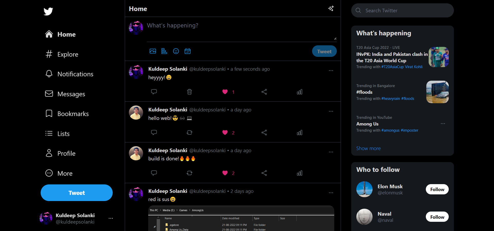
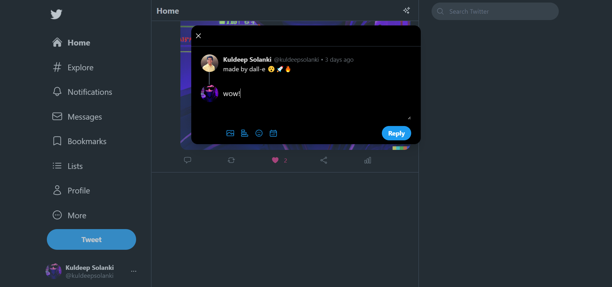
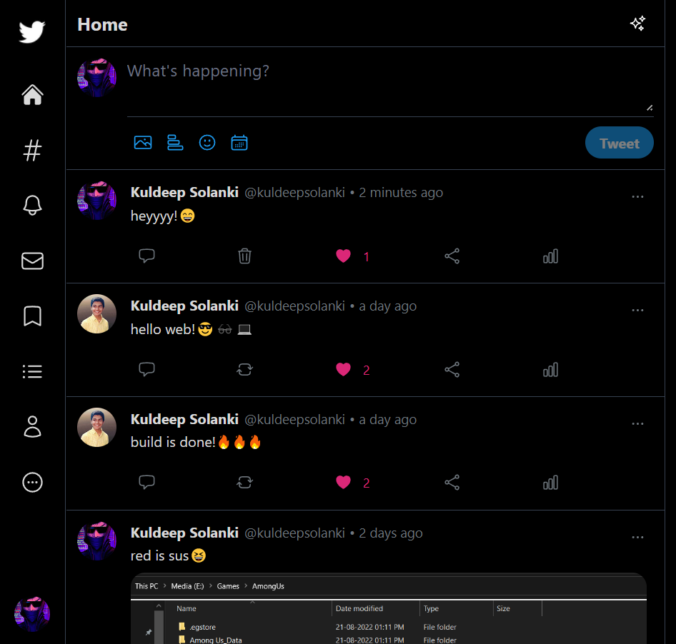
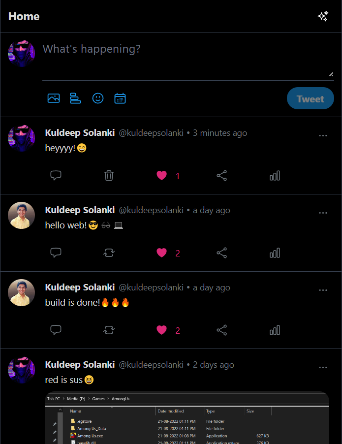
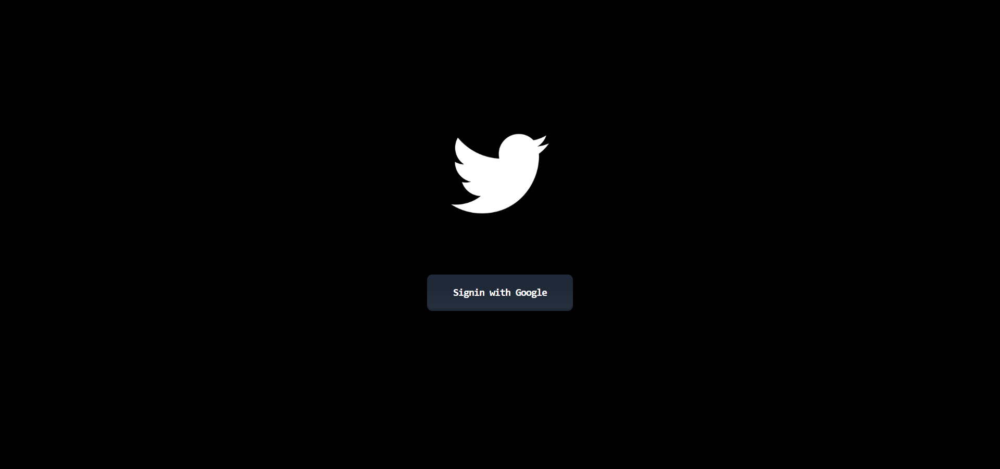
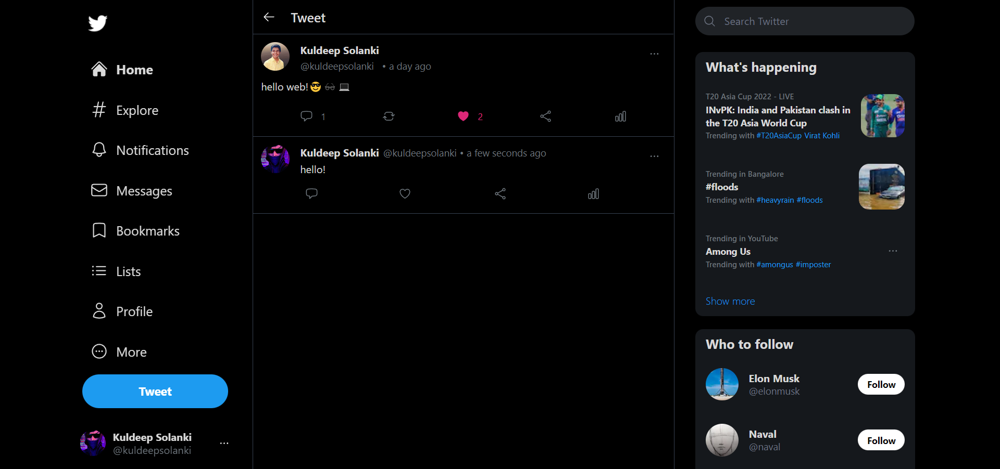

# Twitter Clone 🔥🎆

A cool attempt to clone Twitter using Next.js + Firebase 🚀🤘

## Tech Stack 💻

**Client:** Next.js, NextAuth.js, Recoil, TailwindCSS, EmojiMart, Moment.js,Headless-UI, HeroIcons

**Backend:** Firebase

## Demo 📄

https://twitter-clone-kuldeep.vercel.app/

## Screenshots 📸


<br><br>

<br>

<br>

<br>

<br>


## Features 🔥

- Fully Responsive
- OAuth Login using Google
- Post Tweet
- Delete Tweet
- Like Tweet
- Post Reply to Tweet
- Tweets are shown with corresponding timestamps
- Images can be also added while tweeting
- Custom emoji picker for tweets

## Run Locally 🚧

Clone the project

```bash
  git clone https://github.com/kuldp18/twitter-clone.git
```

Go to the project directory

```bash
  cd twitter-clone
```

Install dependencies

```bash
  npm install
```

Start the server

```bash
  npm run dev
```

## Authors 📙

- [@kuldp18](https://www.github.com/kuldp18)
